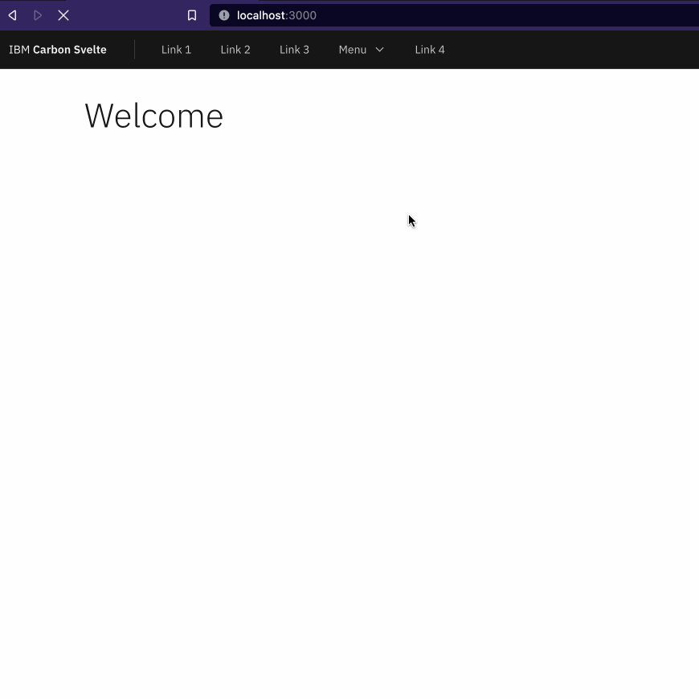
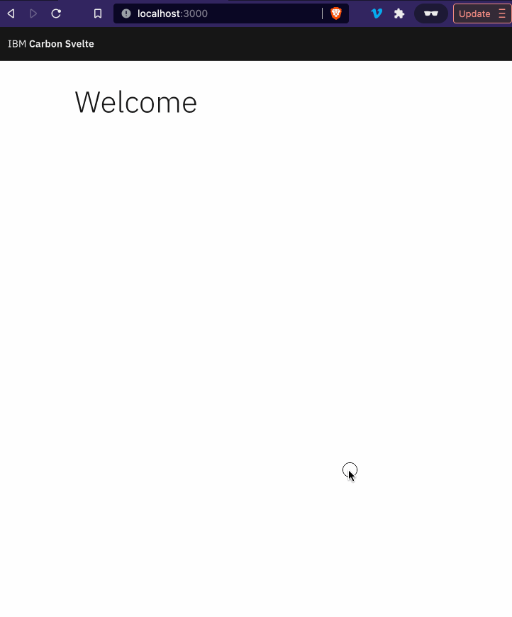

# SideNav issue

Steps to reproduce:

```shell
pnpm install
pnpm dev

http://localhost:3000
```

The problem is that SideNav is flickering on a page reload. It doesn't work like [in this example](https://carbon-components-svelte.onrender.com/components/UIShell):
https://carbon-components-svelte.onrender.com/framed/UIShell/HeaderNav?theme=white




Even when collapsed, hamburger button appears with some delay:

